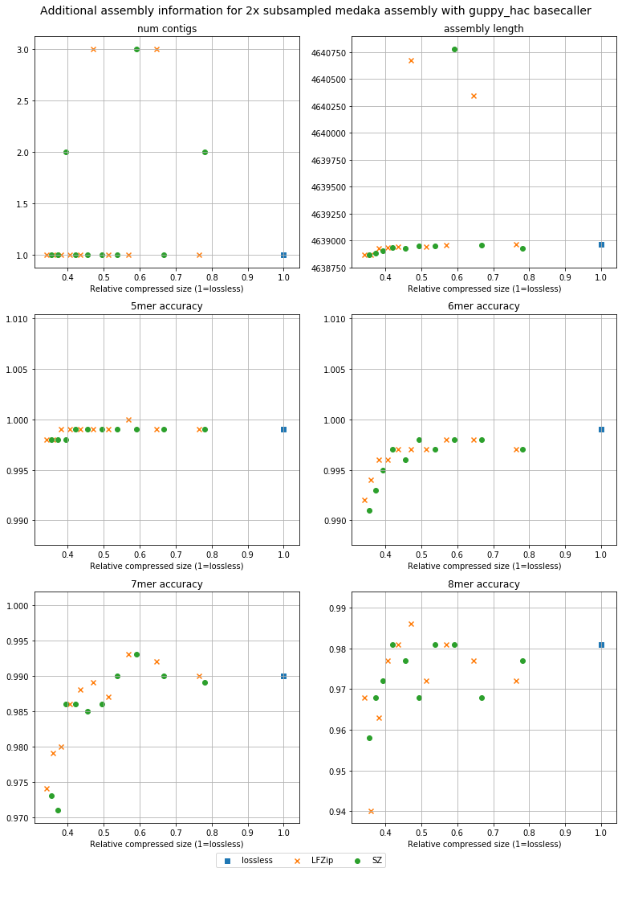

## Plots for E. coli dataset

### Table of contents
 --- 
* [Lossy compression sizes](#lossy-compression-sizes)
* [Basecalling accuracy](#basecalling-accuracy)
* [Assembly accuracy across basecallers](#assembly-accuracy-across-basecallers)
* [Assembly accuracy across assembly stages](#assembly-accuracy-across-assembly-stages)
* [Assembly accuracy across subsampling](#assembly-accuracy-across-subsampling)
* [Contig sizes and homopolymer accuracy](#contig-sizes-and-homopolymer-accuracy)

### Lossy compression sizes
 --- 

### Basecalling accuracy
 --- 

### Assembly accuracy across basecallers
 --- 

 --- 

 --- 

### Assembly accuracy across assembly stages
 --- 

 --- 

 --- 

### Assembly accuracy across subsampling
 --- 

### Contig sizes and homopolymer accuracy
 --- 

 --- 

 --- 

 --- 

